# LalaCloud 项目实验报告

## 实验基本信息：
#### 实验名称
LaLacloud:基于django框架的网易云热门歌手歌曲展示网页搭建

#### 实验日期
2025年6月26日-2025年7月6日

#### 实验人员
杜亦清 计46 2024010792

#### 实验环境
*   **操作系统:** Windows 10
*   **Python 版本:** Python3.13.5
*   **Django 版本:** 例如：Django 5.2.3
*   **数据库:** SQLite

## 实验目的
基于django框架使用python语言搭建网易云音乐热门歌手及其歌曲的展示平台，实现歌手、歌曲的展示、检索、随机推荐及简单的评论功能。


## 实验步骤
#### 搭建django项目
直接使用django框架，借助[日志和教程](https://www.byhy.net/py/django/)学习基本框架的使用。后端部分，重点实现视图函数、模型。
* **模型**：Artist（歌手），Song（歌曲）
<div style="display: flex; gap: 10px;"> 
    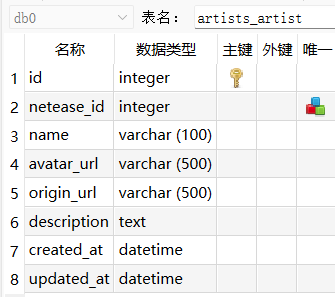 
    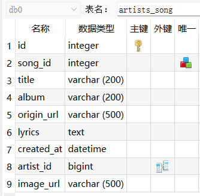
</div>

* **视图函数**：
```python
# 歌手列表页
def artist_list(request)
# 歌手详情页
def artist_detail(request, netease_id)
# 歌曲列表页
def song_list(request)
# 歌曲详情页
def song_detail(request, song_id)
# 歌曲评论
def song_detail(request, song_id)
# 附加功能：随机推荐
def random_artist(request)
```

最终项目主题结构（仅展开后端）：
```
D:.
├─artists
│  ├─migrations
│  │  └─__pycache__
│  ├─utils
│  │  └─__pycache__
|  |  __init__.py  
|  |   lyrics_processor.py # 词云处理
│  └─__pycache__
|  __init__.py  
|  admin.py  
|  apps.py  
|  forms.py  
|  models.py  #模型
|  tests.py  
|  views.py #视图
├─data
|  stopwords.txt  # 词云-停用词
├─lalacloud
│  └─__pycache__
|  __init__.py  
|  __pycache__  
|  asgi.py  
|  settings.py  # 配置
|  urls.py    # 路由
|  wsgi.py
├─static

```
#### 数据获取：pyCrawler
选择网易云音乐平台，通过网易云提供的api路由（如："https://music.163.com/api/artist/top"），采用request+html解析的方式实现对top100热门歌手及其歌曲的爬取。爬取信息包含：歌曲名、歌手名、歌词、歌曲图片url、歌曲原始网站URL；歌手名、歌手图片、歌手简介、歌手原始网站URL。共爬取歌手**100位**，热门歌曲**2967首**。爬取的信息储存在sqlite数据库中，供后期利用django的ORM方法使用。
#### 数据展示：html/css前端
```
├─templates
│  ├─artists
|  |  ├─list.html
|  |  ├─detail.html
│  ├─songs
|  |  ├─list.html
|  |  └─detail.html
├─static
│  ├─css
│  ├─fonts
│  └─images
```
#### 数据分析：
重点针对歌词，采用wordcloud、snowNLP等方法，直观清晰地展示歌手的风格和歌曲的情感态度倾向。具体数据分析报告见后。

## 实验效果展示
### 基础模块
1. 歌手列表页
   1. 首页页眉及Hero模块
   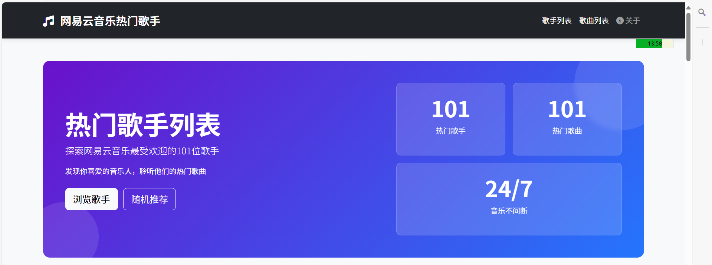
        * 页眉实现歌手列表、歌曲列表两个栏目的跳转
        * “关于”按钮储存网站信息
   2. 歌手名片
        
         * 涵盖歌手姓名、歌手头像、默认五星好评、简介的头部
        
        
         * 设置了鼠标悬浮于歌手名片时的上浮特效；设置了鼠标悬浮于`查看详情`按钮时的色彩效果，点击可跳转至`歌手详情页`
   3. 搜索功能
      实现歌手名字的精准搜索，跳转至`搜索结果页`。利用后端搜索，搜索效率高。前端显示匹配结果数目及搜索用时。
      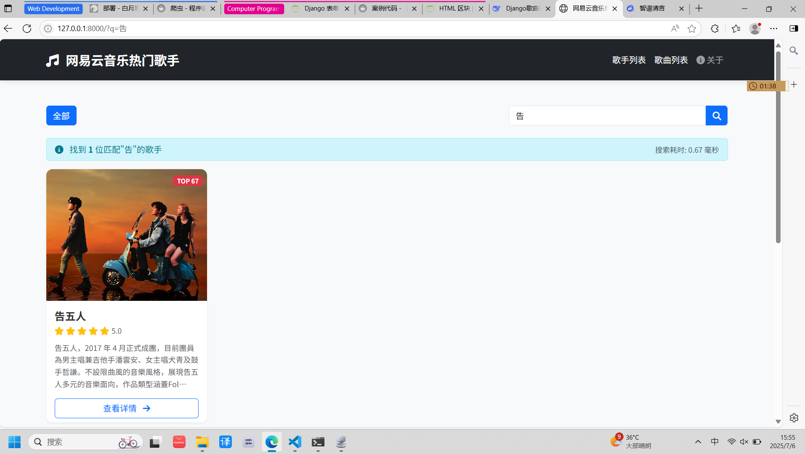 
   4. 分页控件
   由于页数较少，此处不实现输入页码跳转。实现了点击页码跳转、`上一页`、`下一页`
   
   5. 页脚
   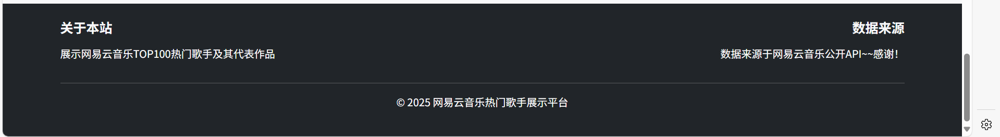
2. 歌手详情页
      1. hero模块
   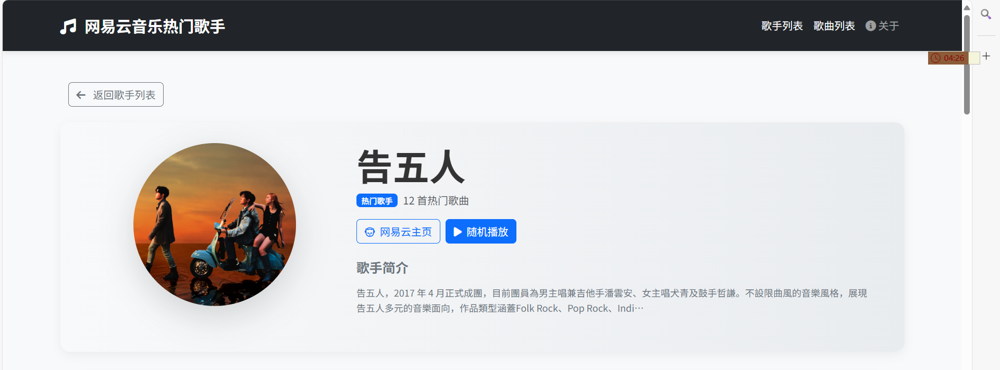
   歌手姓名、歌手头像、跳转至网易云主页的接口、简介的头部
      2. 创新模块：歌词世界
      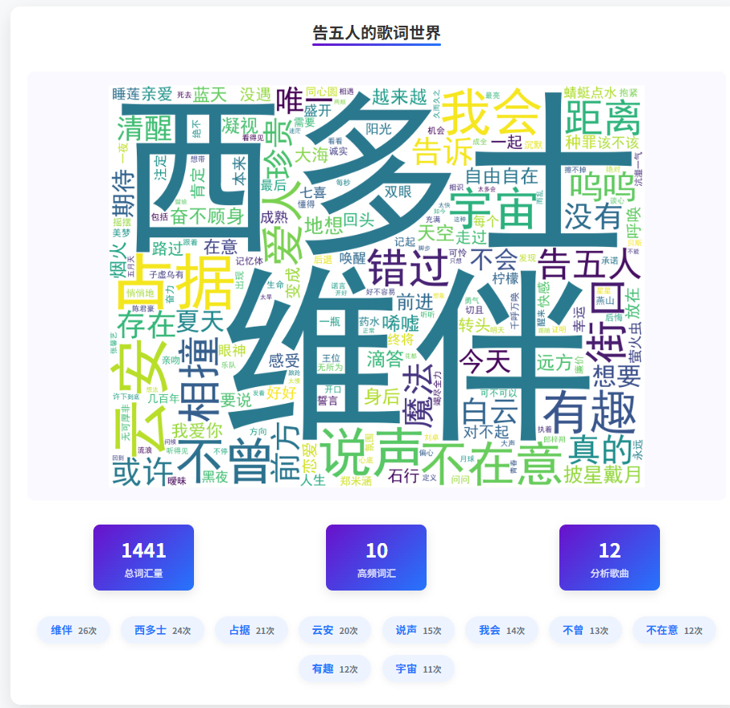
      4. 热门歌曲列表
   以列表方式列举歌曲名、歌手、专辑名。两个按钮分别实现跳转至歌曲详情页，及外链至网易云音乐的歌曲原网页。
   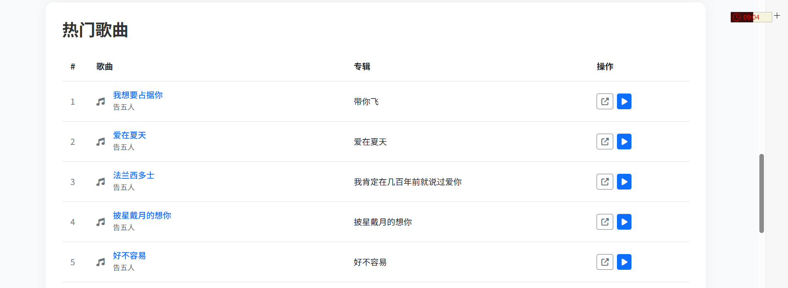
      5. 歌手详细介绍
   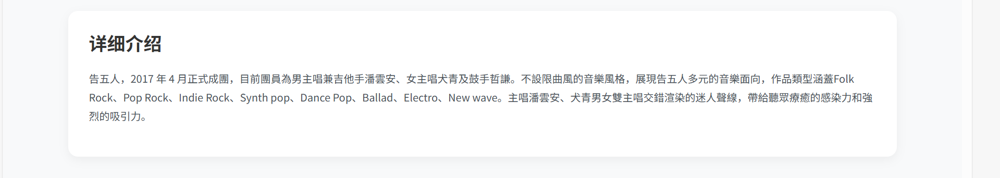
3. 歌曲列表页
      1. hero模块
   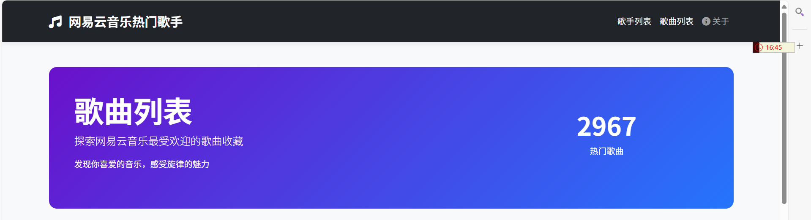
      2. 歌曲列表
   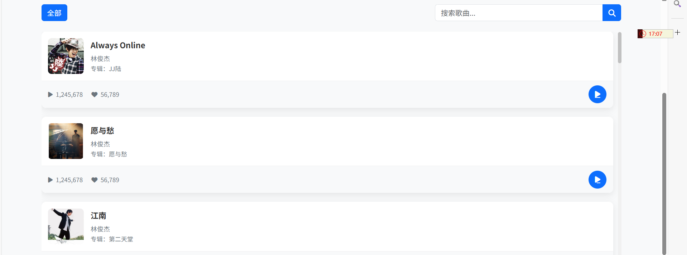
      3. 分页控件：
   实现了页码省略和输入跳转
      4. 搜索功能：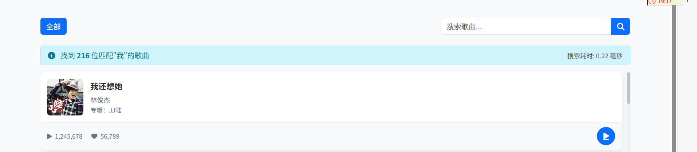
4. 歌曲详情页
      1. hero模块
    
    （播放功能待实现ww，没有爬取音频）
      2. 歌词
   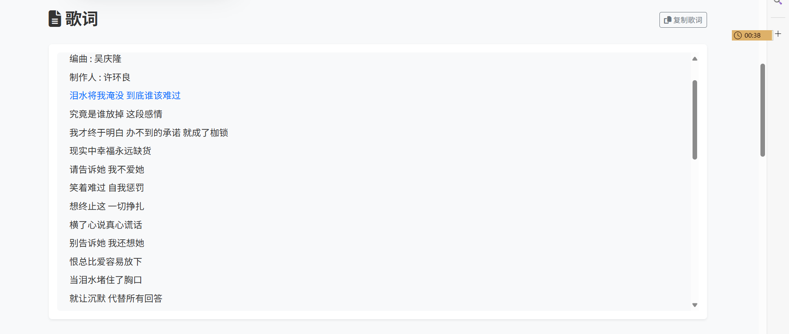
      * 悬浮特效
   
      * 复制歌词按钮
   3. 返回控件：
   
   4. 歌曲信息

   5. 评论功能
   由于网站没有设计登录功能，用户在留言时可以公开地声明自己的昵称，并留下评论。点击`提交评论`后，网页会自动重定向至该歌曲详情页，并在评论列表实时显示新增的评论。评论列表按创建时间倒序从上往下列举，展示永久储存的所有评论。
   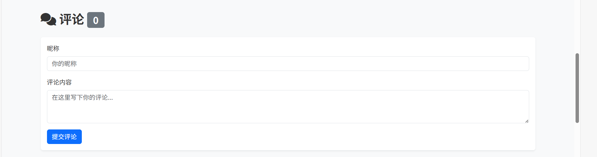
   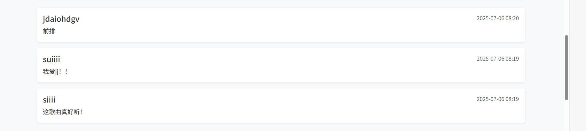
   
   暂无评论时显示↑
   6. 更多歌曲栏
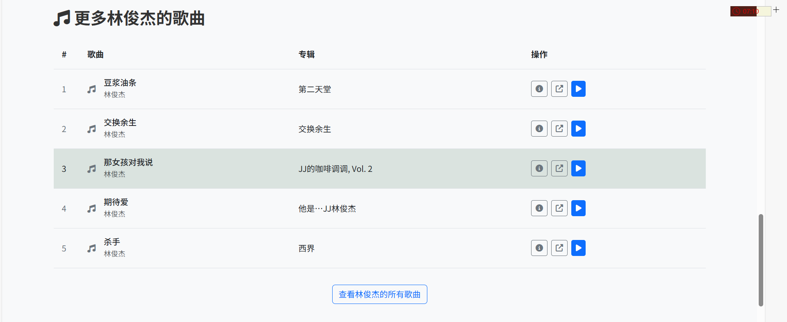
相当于一个简单的歌曲列表，实现外链、链接至歌曲详情页、底部`查看全部`按钮链接至歌手详情页。
   
### 创新模块
1. **猜你喜欢**
   
   * 点击歌手模块跳转至歌手详情页，点击“查看全部”跳转到歌手列表页
2. **实现页面宽度自适应**
   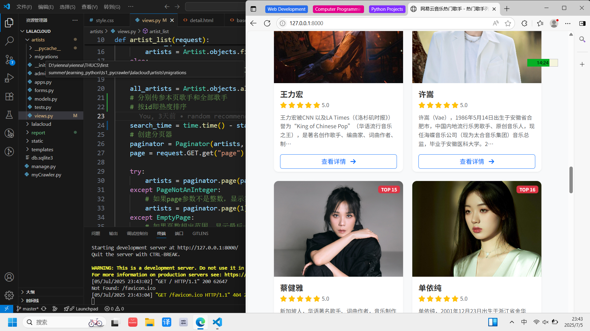
3. **随机推荐功能**
   点击后随机弹出一个`歌手卡片`，悬浮于歌手列表页上方。设置了淡入、谈出的出场退场动画。点击页面非卡片处或点击关闭按钮或右上角的×号即关闭，回到歌手列表页。点击查看详情即跳转至歌手详情页。
   
   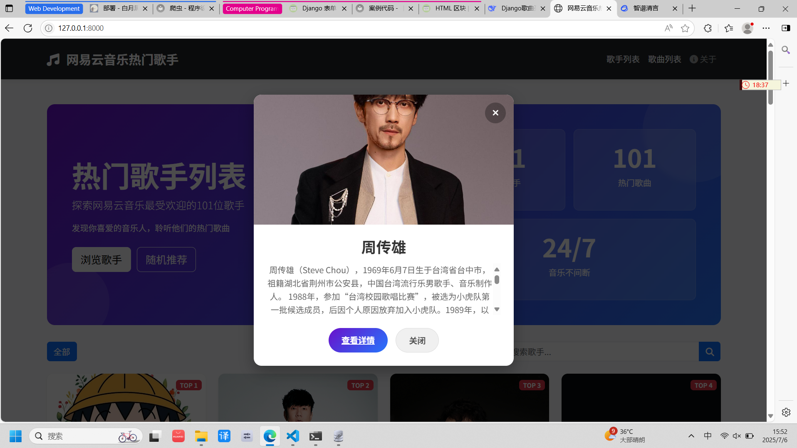
4. **歌手风格词云展示**
   
   在歌手详情页，按照词频绘制歌手所有歌曲中的高频词汇，并统计总词汇量、高频词汇、分析歌曲数目，并列举高频词及出现次数，带给客户直观的风格感受。
   
   设置了鼠标悬浮的阴影上浮特效
## 数据分析报告

## 彩蛋

